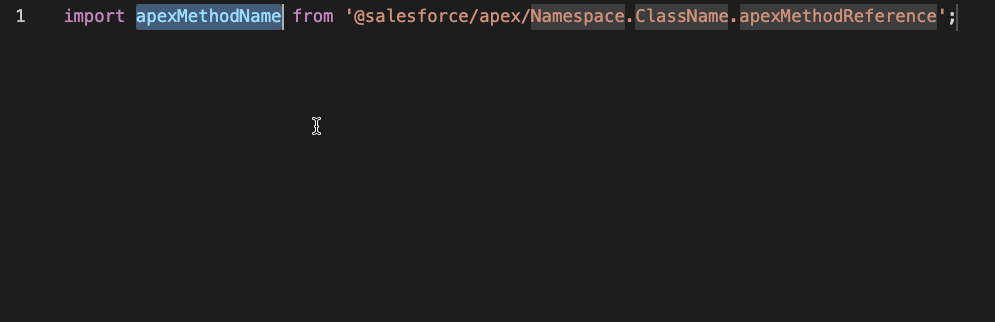
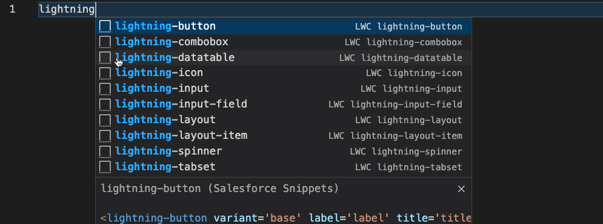

# Salesforce Snippets

A [VS Code Extension](https://marketplace.visualstudio.com/items?itemName=BeyondTheCloud.salesforce-snippets-beyondthecloud) with Apex and LWC Snippets.


[](https://marketplace.visualstudio.com/items?itemName=BeyondTheCloud.salesforce-snippets-beyondthecloud)
[]()
[]()

## List of Snippets

[](#apex)
[](#html)
[](#js)
[](#xml)

### Apex example


<br><br><br>

### LWC JS example


<br><br><br>

### LWC HTML example



## Features

# [Apex](./snippets/apex.json)

<table>
<tr>
<td> Prefix </td>
<td> Example </td>
</tr>

<tr>
<td>assertAreEqual, Assert.areEqual, aae</td>
<td>

```java
Assert.areEqual(1, 2, 'NOT EQUAL');
```

</td>
</tr>

<tr>
<td>assertAreNotEqual, Assert.areNotEqual, aane</td>

<td>

```java
Assert.areNotEqual(1, 1, 'Your custom message here');
```

</td>
</tr>

<tr>
<td>assertFail, Assert.fail, af</td>
<td>

```java
Assert.fail('Your custom message here');
```

</td>
</tr>

<tr>
<td>assertIsFalse, Assert.isFalse, aif</td>
<td>

```java
Assert.isFalse(true, 'Your custom message here');
```

</td>
</tr>

<tr>
<td>assertIsInstanceOfType, Assert.isInstanceOfType, aii</td>
<td>

```java
Assert.isInstanceOfType(new Account(), Contact.class, 'Your custom message here');
```

</td>
</tr>

<tr>
<td>assertIsNotInstanceOfType, Assert.isNotInstanceOfType, aini</td>
<td>

```java
Assert.isNotInstanceOfType(new Account(), Account.class, 'Your custom message here');
```

</td>
</tr>

<tr>
<td>assertIsNotNull, Assert.isNotNull, ainn</td>
<td>

```java
Assert.isNotNull(null, 'Your message here');
```

</td>
</tr>

<tr>
<td>assertIsNull, Assert.isNull, ain</td>
<td>

```java
Assert.isNull(null, 'Your message here');
```

</td>
</tr>

<tr>
<td>assertIsTrue, Assert.isTrue, ait</td>
<td>

```java
Assert.isTrue(null, 'Your message here');
```

</td>
</tr>

<tr>
<td>databaseExecuteBatch, deb</td>
<td>

```java
Id jobId = Database.executeBatch(new BatchLeadConvert(), 200);
```

</td>
</tr>

<tr>
<td>forSoql, foro</td>
<td>

```java
for (Type variable : [SELECT fieldsList FROM Type) {
    //Your code here
}
```

</td>
</tr>

<tr>
<td>fori, itar</td>
<td>

```java
for (Integer i = 0; i < listName.size(); i++) {
    Account acc = listName[i];
    // Your code here
}
```

</td>
</tr>

<tr>
<td>forMap, itme</td>
<td>

```java
for (Id accountId : mapName.keySet()) {
    Account acc = mapName.get(accountId);
    //Your code here
}
```

</td>
</tr>

<tr>
<td>forReversedOrder, ritar</td>
<td>

```java
for (Integer i = listName.size()-1; i >= 0; i--) {
    Account acc = listName[i];
    //Your code here
}
```

</td>
</tr>

<tr>
<td>future</td>
<td>

```java
@future
public static void methodName() {
    //Your code here
}
```

</td>
</tr>

<tr>
<td>if</td>
<td>

```java
if (true) {
    //Your code here
}
```

</td>
</tr>

<tr>
<td>ifElse, ife</td>
<td>

```java
if(true) {
    //Your code here
} else {

}
```

</td>
</tr>

<tr>
<td>instanceOf, inst</td>
<td>

```java
if (objects[0] instanceof Account) {
    Account acc = (Account) objects[0];
}
```

</td>
</tr>

<tr>
<td>invocableMethod</td>
<td>

```java
@InvocableMethod(label='YourLabeL' description='Description' category='Category')
public static List<Account> exampleMethod() {
    //Your code here
}
```

</td>
</tr>

<tr>
<td>isAssignableFrom</td>
<td>

```java
ChildType.class.isAssignableFrom(SourceType.class);
```

</td>
</tr>

<tr>
<td>lastListElement, lst</td>
<td>

```java
myList[myList.size() - 1]
```

</td>
</tr>

<tr>
<td>lazy</td>
<td>

```java
if (myAccount == null) {
    myAccount = new Account();
}
```

</td>
</tr>

<tr>
<td>list, nl</td>
<td>

```java
List<Account> testAccounts = new List<Account>();
```

</td>
</tr>

<tr>
<td>map, nm</td>
<td>

```java
Map<Id, Account> testAccounts = new Map<Id, Account>();
```

</td>
</tr>

<tr>
<td>set, ns</td>
<td>

```java
Set<Id> accountIds = new Set<Id>();
```

</td>
</tr>

<tr>
<td>setOfIds, nsfl</td>
<td>

```java
Set<Id> accountIds = new Map<Id, Account>([SELECT Id FROM Account LIMIT 10]).keySet();
```

</td>
</tr>

<tr>
<td>mapFromList, nmfl</td>
<td>

```java
Map<Id, Account> myAccounts = new Map<Id, Account>(accountsList);
```

</td>
</tr>

<tr>
<td>pro</td>
<td>

```java
{get; private set;}
```

</td>
</tr>

<tr>
<td>prw</td>
<td>

```java
{get; set;}
```

</td>
</tr>

<tr>
<td>final, psf</td>
<td>

```java
public static final
```

</td>
</tr>

<tr>
<td>finalInteger, psfi</td>
<td>

```java
public static final Integer
```

</td>
</tr>

<tr>
<td>finalString, psfs</td>
<td>

```java
public static final String
```

</td>
</tr>

<tr>
<td>select, SEL</td>
<td>

```java
SELECT Id FROM Account
```

</td>
</tr>

<tr>
<td>selectAll, SELALL</td>
<td>

```java
SELECT FIELDS(ALL) FROM Account LIMIT 200
```

</td>
</tr>

<tr>
<td>selectToMap, sqm</td>
<td>

```java
Map<Id, Account> myAccounts = new Map<Id, Account>([SELECT Id FROM Account LIMIT 10]);
```

</td>
</tr>

<tr>
<td>selectToList, sql</td>
<td>

```java
List<Account> myAccounts = [SELECT Id, Name FROM Account];
```

</td>
</tr>

<tr>
<td>selectToObject, sql1</td>
<td>

```java
List<Account> myAccounts = [SELECT Id FROM Account LIMIT 1];
Account myAcc = myAccounts.size() == 1 ? myAccounts.get(0) : null;
```

</td>
</tr>

<tr>
<td>systemAssert, sa</td>
<td>

```java
System.assert(condition, 'Your message here');
```

</td>
</tr>

<tr>
<td>systemAssertEquals, sae</td>
<td>

```java
System.assertEquals(expected, actual, 'Your message here');
```

</td>
</tr>

<tr>
<td>systemAssertEquals, san</td>
<td>

```java
System.assertEquals(null, actual, 'Your message here');
```

</td>
</tr>

<tr>
<td>systemAssertFail, saf</td>
<td>

```java
System.assert(false, 'Your message here');
```

</td>
</tr>

<tr>
<td>systemAssertNotEquals, sane</td>
<td>

```java
System.assertNotEquals(expected, actual, 'Your message here');
```

</td>
</tr>

<tr>
<td>systemAssertNotEquals, sann</td>
<td>

```java
System.assertNotEquals(null, 'Your message here');
```

</td>
</tr>

<tr>
<td>systemDebug, sd</td>
<td>

```java
System.debug(LoggingLevel.DEBUG, 'your message here: ' + variableHere);
```

</td>
</tr>

<tr>
<td>systemDebugPretty, sdp</td>
<td>

```java
System.debug(LoggingLevel.DEBUG, 'your message here: ' + JSON.SerializePretty(objectVariable));
```

</td>
</tr>

<tr>
<td>systemRunAs, sra</td>
<td>

```java
System.runAs(user) {
    //your code here
}
```

</td>
</tr>

<tr>
<td>isTest, tstm</td>
<td>

```java
@IsTest
static void exampleName() {
    //Your code here
    Test.startTest();

    Test.stopTest();
}
```

</td>
</tr>

<tr>
<td>testSetup, tsts</td>
<td>

```java
@TestSetup
static void setup() {
    //Your code here
}
```

</td>
</tr>

<tr>
<td>throw, thr</td>
<td>

```java
throw new CustomException();
```

</td>
</tr>

<tr>
<td>tryCatch, tc</td>
<td>

```java
try {
    //Your code here
} catch (CustomException ex) {

}
```

</td>
</tr>

<tr>
<td>tryCatchFinally, tcf</td>
<td>

```java
try {
    //Your code here
} catch (CustomException ex) {

} finally {

}
```

</td>
</tr>

<tr>
<td>while, wh</td>
<td>

```java
while (condition) {
    //Your code here
}
```

</td>
</tr>

</table>

# LWC

## [HTML](./snippets/lwc-html.json)

<table>
<tr>
<td> Prefix </td>
<td> Example </td>
</tr>
<tr>
<td> lightning-button </td>
<td>

```html
<lightning-button variant='base' label='label' title='title' onclick={handleOnClick} class='cssClass'>
</lightning-button>
```

</td>
</tr>
<tr>
<td> lightning-combobox </td>
<td>

```html
<lightning-combobox
    name='name'
    label='label'
    value={value}
    placeholder='placeholder'
    options={options}
    onchange={handleChange}
></lightning-combobox>
```

</td>
</tr>
<tr>
<td> lightning-datatable </td>
<td>

```html
<lightning-datatable
    key-field='Id'
    data={data}
    columns={columns}
    hide-checkbox-column
></lightning-datatable>
```

</td>
</tr>
<tr>
<td> lightning-icon </td>
<td>

```html
<lightning-icon icon-name='iconName' alternative-text='alternativeText' title='title'>
</lightning-icon>
```

</td>
</tr>
<tr>
<td> lightning-input </td>
<td>

```html
<lightning-input type='type' label='label' onchange='handleOnChange'>
</lightning-input>
```

</td>
</tr>
<tr>
<td> lightning-input-field </td>
<td>

```html
<lightning-input-field field-name='fieldName' disabled read-only required>
</lightning-input-field>
```

</td>
</tr>
<tr>
<td> lightning-layout </td>
<td>

```html
<lightning-layout horizontal-align='horiznotalAlign' vertical-align='verticalAlign' multiple-rows='multipleRows'>
    <lightning-layout-item padding='around-small'>
    </lightning-layout-item>
    <lightning-layout-item padding='around-small'>
    </lightning-layout-item>
    <lightning-layout-item padding='around-small'>
    </lightning-layout-item>
</lightning-layout>
```

</td>
</tr>
<tr>
<td> lightning-layout-item </td>
<td>

```html
<lightning-layout-item size='size' small-device-size='smallDeviceSize' medium-device-size='mediumDeviceSize' large-device-size='largeDeviceSize' padding='around-small'>
</lightning-layout-item>
```

</td>
</tr>
<tr>
<td> lightning-tabset </td>
<td>

```html
<lightning-tabset variant='variant' active-tab-value='two'>
    <lightning-tab label='Item One' value='one'>
        One Content !
    </lightning-tab>
    <lightning-tab label='Item Two' value='two'>
        Two Content !
    </lightning-tab>
    <lightning-tab label='Item Three' value='three'>
        Three Content !
    </lightning-tab>
</lightning-tabset>
```

</td>
</tr>
<tr>
<tr>
<td> lightning-tabset </td>
<td>

```html
<lightning-spinner alternative-text='alternativeText' size='size'>
</lightning-spinner>
```

</td>
</tr>
<tr>
<td> slot </td>
<td>

```html
<slot name='name'>
</slot>
```

</td>
</tr>
<tr>
<td> templateForEach </td>
<td>

```html
<template for:each={array} for:item='item'>
</template>
```

</td>
</tr>
<tr>
<td> templateIfFalse </td>
<td>

```html
<template if:false={property}>
</template>
```

</td>
</tr>
<tr>
<td> templateIfTrue </td>
<td>

```html
<template if:true={property}>
</template>
```

</td>
</tr>
<tr>
<td> templateIteratorIt </td>
<td>

```html
<template iterator:it={array}>
    <div key={it.value.Id}>
    <div if:true={it.first}></div>
    {it.value.Name}
    <div if:true={it.last}></div>
    </div>
</template>
```

</td>
</tr>
</table>

## [JS](./snippets/lwc-js.json)

<table>
<tr>
<td> Prefix </td>
<td> Example </td>
</tr>
<tr>
<td> asyncAwait </td>
<td>

```js
try {
    const result = await apexMethodName({ apexMethodParams });
} catch (error) {
    console.error(error)
}
```

</td>
</tr>
<tr>
<td> constructor </td>
<td>

```js
constructor() {

}
```

</td>
</tr>
<tr>
<td> currentPageReference </td>
<td>

```js
import { CurrentPageReference } from 'lightning/navigation';
@wire(CurrentPageReference)
pageRef;
```

</td>
</tr>
<tr>
<td> customEvent </td>
<td>

```js
new CustomEvent('eventName', {
    detail: details,
    bubbles: false,
    composed: false
});
```

</td>
</tr>
<tr>
<td> disconnectedCallback </td>
<td>

```js
disconnectedCallback() {

}
```

</td>
</tr>
<tr>
<td> dispatchEvent </td>
<td>

```js
this.dispatchEvent(customEvent);
```

</td>
</tr>
<tr>
<td> errorCallback </td>
<td>

```js
errorCallback(error, stack) {

}
```

</td>
</tr>
<tr>
<td> forEach </td>
<td>

```js
array.forEach((item, index) => {

});
```
</td>
</tr>
<tr>
<td> getObjectInfo </td>
<td>

```js
import { getObjectInfo } from 'lightning/uiObjectInfoApi';
import objectName from '@salesforce/schema/objectApiName';

@wire(getObjectInfo, { objectApiName: objectName })
propertyOrFunction;
```

</td>
</tr>
<tr>
<td> getPicklistValues </td>
<td>

```js
import { getPicklistValues } from 'lightning/uiObjectInfoApi';
import fieldName from '@salesforce/schema/objectApiName.fieldApiName';

@wire(getPicklistValues, { recordTypeId: '012000000000000AAA', fieldApiName: fieldName })
propertyOrFunction;
```

</td>
</tr>
<tr>
<td> getRecord </td>
<td>

```js
import { getRecord } from 'lightning/uiRecordApi';

@wire(getRecord, { recordId: 'recordId', fields: fields })
propertyOrFunction;
```

</td>
</tr>
<tr>
<td> getRecords </td>
<td>

```js
import { getRecords } from 'lightning/uiRecordApi';

@wire(getRecords, { records: [ { recordIds: 'recordIds', fields: fields } ] })
propertyOrFunction;
```

</td>
</tr>
<tr>
<td> importApexMethod </td>
<td>

```js
import apexMethodName from '@salesforce/apex/Namespace.ClassName.apexMethodReference';
```

</td>
</tr>
<tr>
<td> importField </td>
<td>

```js
import fieldName from '@salesforce/schema/objectApiName.fieldApiName';
```

</td>
</tr>
<tr>
<td> importHasPermission </td>
<td>

```js
import hasPermissionName from '@salesforce/userPermission/PermissionName';
```

</td>
</tr>
<tr>
<td> importNavigationMixin </td>
<td>

```js
import { NavigationMixin } from 'lightning/navigation';
```

</td>
</tr>
<tr>
<td> importObject </td>
<td>

```js
import objectName from '@salesforce/schema/objectApiName';
```

</td>
</tr>
<tr>
<td> importUserId </td>
<td>

```js
import userId from '@salesforce/user/Id';
```

</td>
</tr>
<tr>
<td> map </td>
<td>

```js
array.map((item, index) => {
    return {

    }
});
```

</td>
</tr>
<tr>
<td> importMessageChannel </td>
<td>

```js
import channelName from '@salesforce/messageChannel/channelReference';
```

</td>
</tr>
<tr>
<td> navigate </td>
<td>

```js
this[NavigationMixin.Navigate]({
    type: 'standard__app',
    attributes: {
         // Different per page type.
        // Check documentation: https://developer.salesforce.com/docs/component-library/documentation/en/lwc/lwc.reference_page_reference_type
    },
    state: {
         // Different per page type.
    }
});
```

</td>
</tr>
<tr>
<td> querySelector </td>
<td>

```js
this.template.querySelector('element');
```

</td>
</tr>
<tr>
<td> querySelectorAll </td>
<td>

```js
this.template.querySelectorAll('element');
```

</td>
</tr>
<tr>
<td> importRefreshApex </td>
<td>

```js
import { refreshApex } from '@salesforce/apex';
```

</td>
</tr>
<tr>
<td> render </td>
<td>

```js
render() {

}
```

</td>
</tr>
<tr>
<td> renderedCallback </td>
<td>

```js
initialRender = true;
renderedCallback() {
    if (!this.initialRender) {
        return;
    }
    // Your code here.
    this.initialRender = false;
}
```

</td>
</tr>
<tr>
<td> showToastEvent </td>
<td>

```js
import { ShowToastEvent } from 'lightning/platformShowToastEvent';
new ShowToastEvent({ 'title', 'message', 'variant' });
```

</td>
</tr>
<tr>
<td> importStaticResource </td>
<td>

```js
import resourceName from '@salesforce/resourceUrl/resourceName';
```
</td>
</tr>
<tr>
<td> thenCatch </td>
<td>

```js
apexMethodName({ apexMethodParams })
.then(result => {

})
.catch(error => {
    console.error(error)
});
```

</td>
</tr>
<tr>
<td> wireMethod </td>
<td>

```js
@wire(apexMethodName, { apexMethodParams })
wiredName({ error, data }) {
    if (data) {

    } else if (error) {
        console.error(error);
    }
}
```

</td>
</tr>
<tr>
<td> wireProperty </td>
<td>

```js
@wire(apexMethodName, { apexMethodParams })
property;
```

</td>
</tr>
</table>

## [XML](./snippets/lwc-xml.json)

<table>
<tr>
<td> Prefix </td>
<td> Example </td>
</tr>
<tr>
<td> capability </td>
<td>

```xml
<capability>lightningCommunity__RelaxedCSP</capability>
<capability>lightning__ServiceCloudVoiceToolkitApi</capability>
```

</td>
</tr>
<tr>
<td> isExposed </td>
<td>

```xml
<isExposed>true</isExposed>
```

</td>
</tr>
<tr>
<td> masterLabel </td>
<td>

```xml
<masterLabel>titleOfTheComponent</masterLabel>
```

</td>
</tr>
<tr>
<td> targets </td>
<td>

```xml
<targets>
    <target>lightning__AppPage</target>
</targets>
```

</tr><tr>
<td> targetConfig </td>
<td>

```xml
<targetConfig targets="lightningCommunity__Page">
    <propertyType
    name="copied from clipboard"
    label="label"
    type|extension="type"
    default="default"
    description="description"
    />
</targetConfig>
```

</tr>
<tr>
<td> propertyType </td>
<td>

```xml
<propertyType
    name="copied from clipboard"
    label="label"
    type|extension="type"
    default="default"
    description="description"
/>
```

</td>
</tr>
</table>

## Release Notes

### 1.2.3

Apex Snippets and documentation update.
